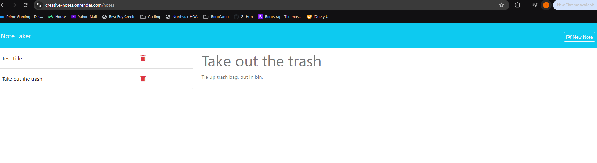

# Creative-Notes

This application uses Express.js back end and retrieves note data from a JSON file. It will allow you to create, save and delete any notes you decide to make. This application has been deployed on Render to show the completion of the front end and back end communication.

## Usage

1. Create a Title.
2. Create notes.
3. Save Notes.
4. Delete completed or unwanted notes.

## Render Link

[Link to Render](https://creative-notes.onrender.com)

## Additional Information

- Clear form (top right) will delete everything you have typed so be careful.
- Deleting notes was optional, but managed to get it working.

## Screenshots

